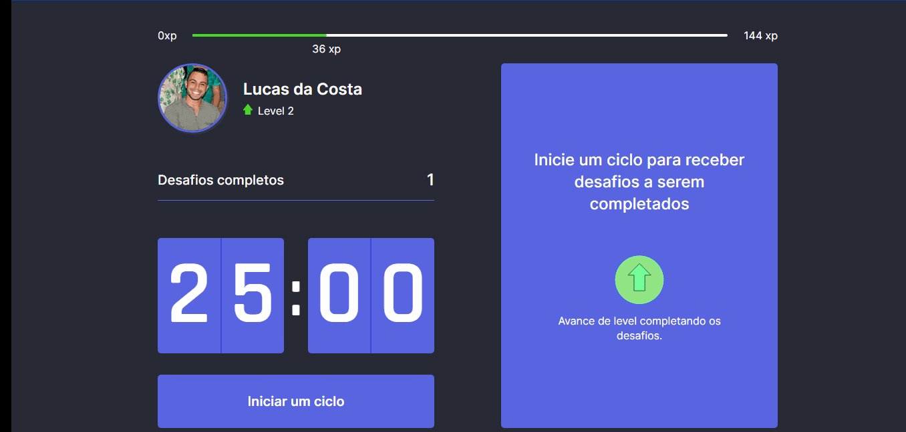

<h1>Move.It - Dark Mode</h1>
<h3>Semana NLW 4 - Rocketseat</h3>

[PROJETO NA <strong>VERCEL</strong>](https://moveit-next-five-alpha.vercel.app/)

<h3>Tecnologias usadas </h3>
✔ ReactJS;  
✔ NextJS;  
✔ TypeScript; 
e a biblioteca Lottie para animação em JSON.
