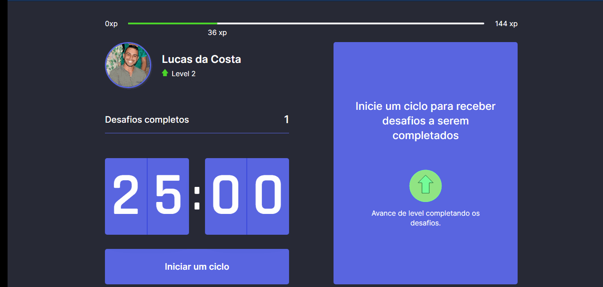

<h1>Move.It - Dark Mode</h1>
<h3>Semana NLW 4 - Rockseat</h3>

Para rodar o projeto MoveIt na sua própria máquina vamos precisar do yarn instalado na sua máquina. Caso não tenha [Clique aqui](https://yarnpkg.com/).

Após isso clique em Code e faça o download ZIP da aplicação, com tudo pronto vamos executar o CMD da máquina, realizando a navegação com o comando cd Desktop, e depois cd e o nome do projeto (Obs: precisa estar descompactado e na sua área de trabalho 😁).
Agora é só executar o comando <strong>yarn start</strong>.

<h3>Tecnologias usadas </h3>
✔ ReactJS;  
✔ NextJS;  
✔ TypeScript; 
e a biblioteca Lottie para animação em JSON.
# NLW
⌢丠坌•਍⌢丠坌•਍
